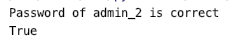

# CS307 Project-12306
Members: 梁钰栋11711217  郑瑞麒 1172501

## database design


`District` table is used to verify the validation of the registered user's ID card number. `database_storage`, as a view, stores the size and percentage of each table in the database. `capacity` table stores the maximum seat number of each carriage on one train. `Journey` table contains all the station passed by each train, including their arrive time, depature time, and distance. This database contains the full stations and train number  information of China railway (excluding the additional carriages on holiday). Administrators and users are seperated, every user has unique ID number. When one user attemptes to book a train, the information will be stroed in `order` table. The staus in `order`indicates whether the order is booked, paied or canceled. Once the order is paid, the information of the order will be stored in `ticket` table.

Picture of `Journey` table:


Picture of `station` table, for example in City "成都", there are 31 stations.


### Database design highlight:

- #### Index

Index on `order`, `user`, `admin` several tables


- #### Trigger 

  


- #### View


## Backend

- ### Add admin and user

The password stored in database has been encrypted.

```python
if get.admin('admin_2') is None:
    registered.admin('admin_2', '12345')
```


The validation of the ID number will be checked by the ORM trigger.

```python
if get.admin('user_2') is None:
    registered.user('user_2', '18912341234', '44190019971024031X', '1234567')
```

Check the password of Admin.

```python
print('Password of admin_2 is correct')
print(check.admin_password('admin_2', '12345'))
```



- ### ORM

ORM in Python language avoid injection, and we also create trigger in ORM in case of invalid input.


- ### Search train

Direct train:

```python
print('利川(2594)到深圳北(451)')
print(get.train_numbers_by_stations('利川', '深圳北'))
# the result is ['G1311', 'G1314']
```

Trains that have to transfer. Show first 10 ways. 

```python
print('成都东 到 深圳北 （无直达）')
i = get.train_numbers_by_stations_transfer('成都东', '深圳北' )
for _ in range(10):
    print(next(i))
```


Circle Train:

```python
print('Circle line from 厦门 to 厦门')
print(get.train_numbers_by_stations('厦门', '厦门'))

# the result is ['D6315', 'D6318']
```


## Frontend

